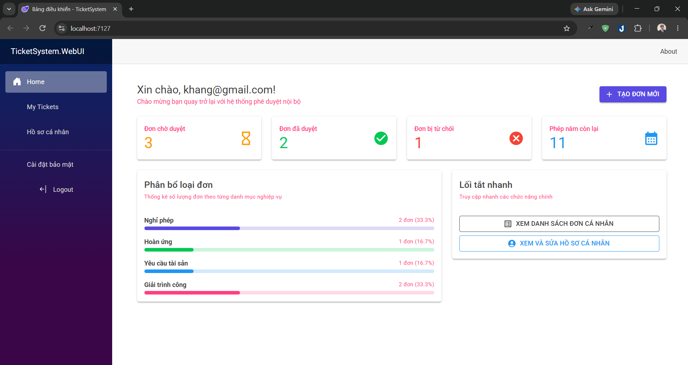
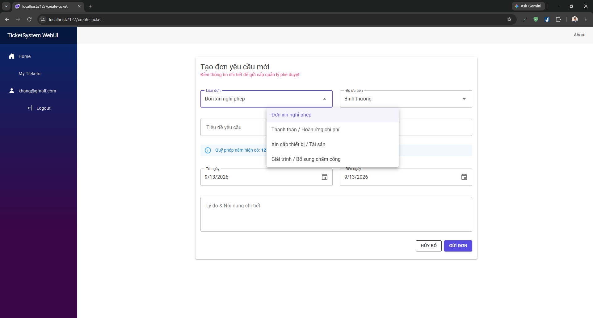
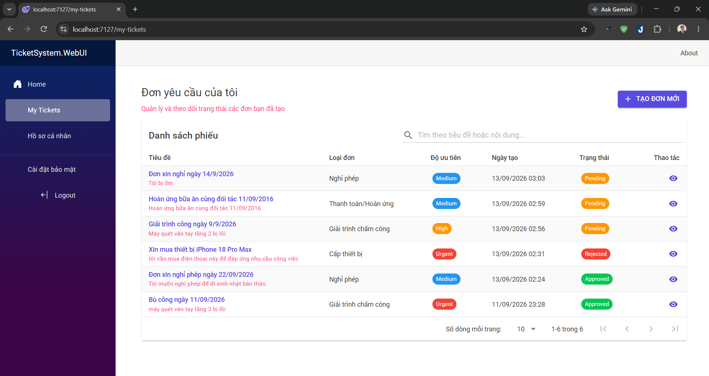
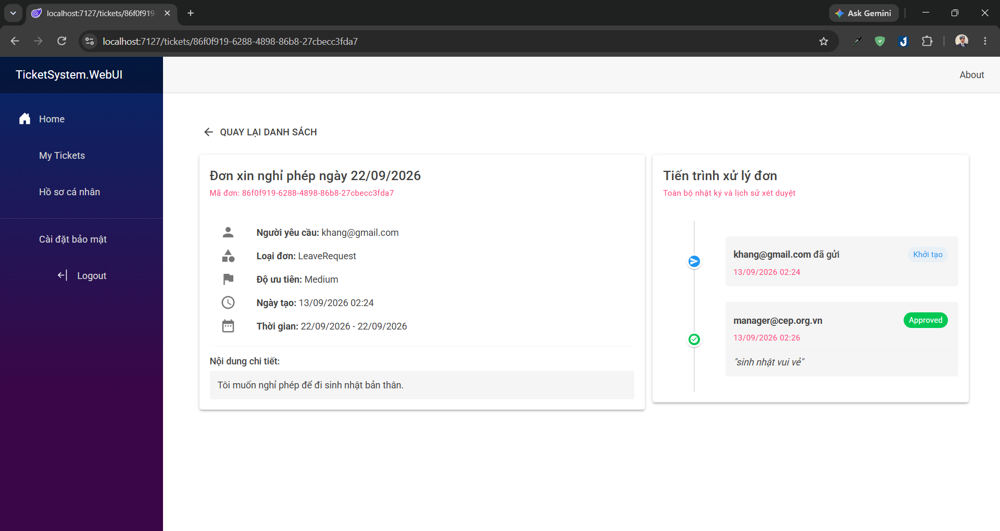

# Ticket Management System

Hệ thống quản trị và duyệt phiếu yêu cầu nội bộ (xin nghỉ phép, thanh toán chi phí, cấp thiết bị, giải trình chấm công). 

Dự án được xây dựng bằng **Blazor Server (.NET 10)** kết hợp thư viện giao diện **MudBlazor**, tổ chức code theo cấu trúc **Clean Architecture**.

[](https://dotnet.microsoft.com/)
[](https://dotnet.microsoft.com/apps/aspnet/web-apps/blazor)
[](https://mudblazor.com/)
[](https://blog.cleancoder.com/uncle-bob/2012/08/13/the-clean-architecture.html)

---

## 📸 Giao diện ứng dụng

### Bảng điều khiển (Dashboard)


#### Form tạo đơn mới


#### Danh sách đơn cá nhân (My Tickets)


### Lịch sử của một đơn (Audit Log)


---

## 🛠️ Công nghệ sử dụng

- **Backend / UI**: C#, Blazor Server (.NET 10), MudBlazor
- **Kiến trúc**: Clean Architecture (Domain, Application, Infrastructure, WebUI)
- **Database**: SQL Server, Entity Framework Core
- **Xác thực & Phân quyền**: ASP.NET Core Identity (Role-based: Manager & Employee)
- **Validation**: FluentValidation

---

## ✨ Chức năng chính

- **Xác thực & Phân quyền**: 
  - Đăng ký, đăng nhập tài khoản.
  - Phân quyền theo Role (`Manager` và `Employee`). Quản lý có thêm trang duyệt đơn riêng.
- **Tạo và quản lý phiếu yêu cầu**:
  - Form tạo đơn tự đổi các ô nhập liệu tùy theo loại yêu cầu (Nghỉ phép, Hoàn ứng tiền, Cấp thiết bị, Chấm công).
  - Tự động tính số ngày nghỉ dựa trên ngày bắt đầu và kết thúc.
- **Quản lý quỹ phép**:
  - Kiểm tra số ngày nghỉ không được vượt quá số ngày phép còn lại.
  - Tự động trừ ngày phép của nhân viên khi Quản lý duyệt đơn nghỉ phép.
- **Quy trình xét duyệt & Lịch sử**:
  - Quản lý có thể Duyệt hoặc Từ chối kèm lời nhắn.
  - Dòng thời gian (Timeline) ghi lại toàn bộ lịch sử: ai gửi, ai duyệt/từ chối, vào lúc nào và ghi chú gì.
- **Trang chủ (Dashboard) & Hồ sơ**:
  - Xem nhanh số đơn chờ duyệt, đơn đã duyệt, số ngày phép còn lại và tỷ lệ các loại đơn.
  - Trang cá nhân xem và cập nhật họ tên, phòng ban.

---

## 🚀 Hướng dẫn cài đặt và chạy thử

### 1. Chuẩn bị
- Đã cài [.NET 10 SDK](https://dotnet.microsoft.com/en-us/download).
- Có sẵn SQL Server (LocalDB hoặc SQL Developer/Express).

### 2. Cấu hình Database
Mở file `appsettings.json` trong thư mục `src/TicketSystem.WebUI/` để kiểm tra lại chuỗi kết nối:

```json
"ConnectionStrings": {
  "DefaultConnection": "Server=(SỬA-Ở-DÂY);Database=TicketSystemDb;Trusted_Connection=True;MultipleActiveResultSets=true;TrustServerCertificate=True"
}
```

### 3. Chạy lệnh Migration & Start dự án
Mở Terminal tại thư mục gốc của project:

```bash
# Cập nhật database
dotnet ef database update --project src/TicketSystem.Infrastructure --startup-project src/TicketSystem.WebUI

# Chạy ứng dụng
dotnet run --project src/TicketSystem.WebUI
```

---

## 👤 Tài khoản dùng thử

Hệ thống tự tạo sẵn tài khoản Quản lý khi chạy lần đầu:

- **Tài khoản Quản lý (Manager):**
  - Email: `manager@cep.org.vn`
  - Mật khẩu: `Cep@123`
- **Tài khoản Nhân viên (Employee):**
  - Bạn có thể bấm **Register** trên giao diện để tự tạo tài khoản mới trải nghiệm.
