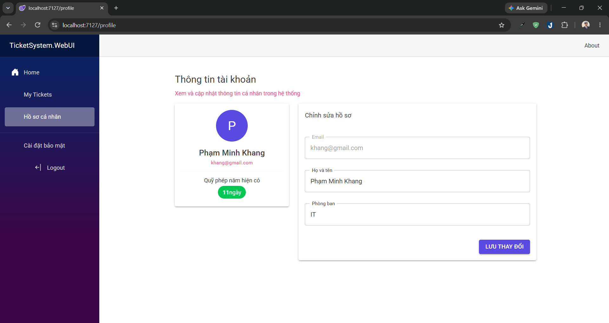
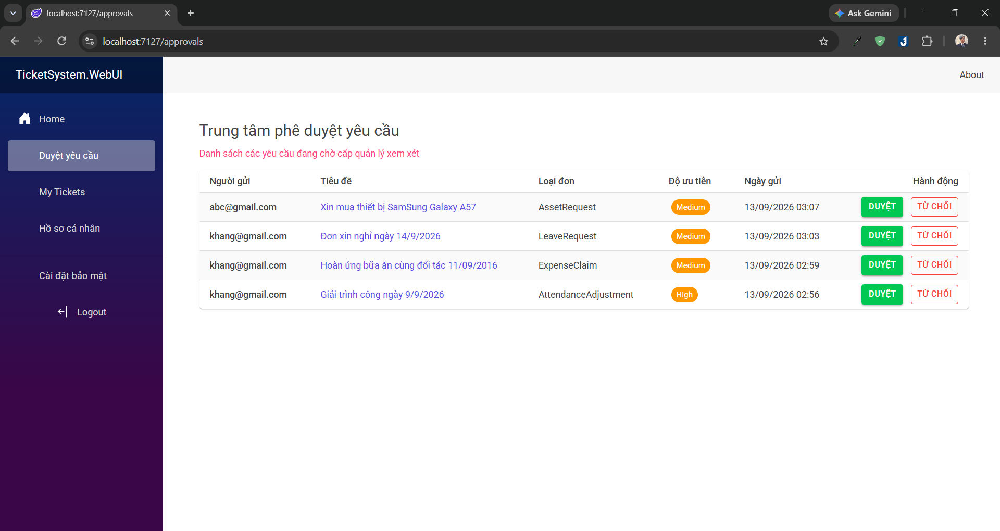
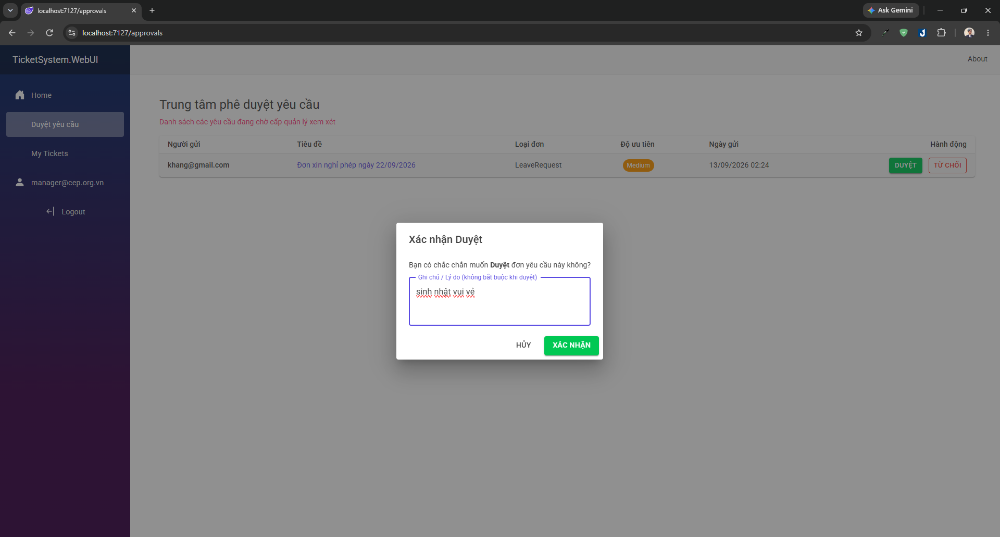

# 🎫 TicketSystem

> Hệ thống quản trị và duyệt phiếu yêu cầu nội bộ (xin nghỉ phép, thanh toán chi phí, cấp thiết bị, giải trình chấm công). Dự án được xây dựng bằng **Blazor Server (.NET 10)** kết hợp thư viện giao diện **MudBlazor**, tổ chức code theo cấu trúc **Clean Architecture**.

---

## ⚡ Trải nghiệm nhanh

Website đã được triển khai trực tiếp tại: **[http://khangpham.runasp.net/](http://khangpham.runasp.net/)**

Các tài khoản đã được đăng ký sẵn để phục vụ người dùng test, bạn có thể tự tạo tài khoản mới nếu muốn.

| Vai trò | Email đăng nhập | Mật khẩu | Quyền hạn nổi bật |
| :--- | :--- | :--- | :--- |
| **Quản lý (Manager)** | `manager@cep.org.vn` | `Cep@123` | Xét duyệt/từ chối đơn, xem dashboard toàn cơ quan |
| **Nhân viên 1 (Employee)** | `khang@gmail.com` | `Cep@123` | Tạo đơn xin nghỉ, hoàn ứng, theo dõi tiến độ cá nhân |
| **Nhân viên 2 (Employee)** | `abc@gmail.com` | `Cep@123` | Tạo đơn xin nghỉ, hoàn ứng, theo dõi tiến độ cá nhân |

---

## 📸 Giao diện ứng dụng

### 1. Dành cho Nhân viên & Tính năng chung
* **Bảng điều khiển (Dashboard):** Hiển thị thống kê cá nhân và tỷ lệ phân bổ các loại đơn.
  
* **Danh sách đơn cá nhân (My Tickets):** Tìm kiếm nhanh, lọc trạng thái, phân trang và xem chi tiết.
  
* **Form tạo đơn linh hoạt:** Tự động điều chỉnh các trường nhập và kiểm tra hạn mức phép năm khả dụng.
  
* **Tiến trình xử lý đơn (Audit Log Timeline):** Dòng thời gian chi tiết ghi nhận người duyệt, thời gian và ý kiến phản hồi.
  
* **Hồ sơ cá nhân (Profile):** Quản lý thông tin liên hệ và tra cứu số dư ngày phép.
  

### 2. Dành riêng cho Quản lý (Manager)
* **Trung tâm phê duyệt (Approval Hub):** Quản lý tập trung toàn bộ các yêu cầu đang chờ xử lý.
  
* **Hộp thoại duyệt đơn:** Nhập ghi chú/lý do trước khi xác nhận Duyệt hoặc Từ chối phiếu.
  

---

## 🛠️ Công nghệ sử dụng

- **Backend / UI**: C#, Blazor Server (.NET 10), MudBlazor

- **Kiến trúc**: Clean Architecture (Domain, Application, Infrastructure, WebUI)

- **Database**: SQL Server, Entity Framework Core

- **Xác thực & Phân quyền**: ASP.NET Core Identity (Role-based: Manager & Employee)

- **Validation**: FluentValidation

---

## ✨ Chức năng chính

- **Xác thực & Phân quyền**: 

  - Đăng ký, đăng nhập tài khoản.

  - Phân quyền theo Role (`Manager` và `Employee`). Quản lý có thêm trang duyệt đơn riêng.

- **Tạo và quản lý phiếu yêu cầu**:

  - Form tạo đơn tự đổi các ô nhập liệu tùy theo loại yêu cầu (Nghỉ phép, Hoàn ứng tiền, Cấp thiết bị, Chấm công).

  - Tự động tính số ngày nghỉ dựa trên ngày bắt đầu và kết thúc.

- **Quản lý quỹ phép**:

  - Kiểm tra số ngày nghỉ không được vượt quá số ngày phép còn lại.

  - Tự động trừ ngày phép của nhân viên khi Quản lý duyệt đơn nghỉ phép.

- **Quy trình xét duyệt & Lịch sử**:

  - Quản lý có thể Duyệt hoặc Từ chối kèm lời nhắn.

  - Dòng thời gian (Timeline) ghi lại toàn bộ lịch sử: ai gửi, ai duyệt/từ chối, vào lúc nào và ghi chú gì.

- **Trang chủ (Dashboard) & Hồ sơ**:

  - Xem nhanh số đơn chờ duyệt, đơn đã duyệt, số ngày phép còn lại và tỷ lệ các loại đơn.

  - Trang cá nhân xem và cập nhật họ tên, phòng ban.

---
